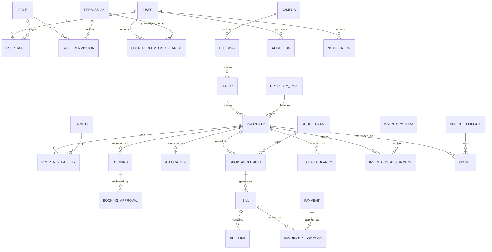

# Phase 2 - Database Design

## Objective
Define the normalized relational model, constraints, conflict-prevention strategy, and seed strategy for the estate management system before any application scaffolding.

## Domain Model Summary
The system centers on a shared property model, a shared booking model, allocation workflows, tenancy and billing, notices, documents, notifications, and audit history.

### Recommended Core Entities
- User
- Role
- Permission
- UserRole
- RolePermission
- UserPermissionOverride
- PermissionScope
- Session
- RefreshTokenFamily
- RefreshToken
- PropertyGroup or PropertyCluster if needed for campus-level grouping
- Campus
- Building
- Floor
- Department
- Designation
- EmployeeGrade
- PropertyType
- PropertyStatus
- AvailabilityStatus
- OccupancyStatus
- PaymentMethod
- UtilityType
- Facility
- PropertyFacility
- Property
- PropertyDetail tables for room, office, shop, flat, auditorium, lawn, and executive club specifics
- Booking
- BookingResource if multi-resource bookings are confirmed
- BookingApproval
- BookingDocument
- Allocation
- AllocationHistory
- ShopTenant
- ShopAgreement
- AgreementUtilityRule
- Bill
- BillLine
- Payment
- PaymentAllocation
- Receipt
- FlatOccupancy
- FlatEligibilityRule
- RetirementOccupancyRule
- InventoryItem
- PropertyInventory
- InventoryMovement
- NoticeTemplate
- Notice
- Notification
- NotificationPreference
- FileObject
- AuditLog
- AuditLogDetail
- SystemSetting
- HolidayCalendarEntry
- ClosureWindow

## Normalization Approach
- Use a normalized master-data design for reusable reference tables.
- Keep property-specific differences in detail tables rather than one generic wide property table.
- Keep financial records separate from operational allocation records.
- Model history as append-only event or history tables where overwrite would destroy auditability.
- Use reference tables for statuses rather than free-text status strings.

## Entity Relationships
- Users can have many roles through UserRole.
- Roles can have many permissions through RolePermission.
- Users can have direct overrides through UserPermissionOverride.
- Buildings belong to campuses if campus support is enabled.
- Floors belong to buildings.
- Properties belong to floors and property types.
- Properties can have many facilities through PropertyFacility.
- Bookings belong to one property in v1 unless multi-resource bookings are approved.
- Allocations belong to one property and one assignee entity such as department, employee, or tenant.
- Shop agreements belong to a shop property and tenant.
- Bills belong to an agreement or other billable account.
- Payments can be allocated across one or more bills.
- Notices can point to a booking, allocation, agreement, bill, or flat occupancy event.
- Audit logs are append-only and reference actor, entity, and correlation metadata.

## ER Diagram

## Table Descriptions

### User and Access Control
- User: identity record, status, password hash, profile fields, and security flags.
- Role: named role with description and enabled flag.
- Permission: atomic privilege with module, action, and optional scope.
- UserRole: many-to-many assignment with optional validity window.
- RolePermission: many-to-many grant relationship.
- UserPermissionOverride: direct allow or deny override for a user.
- PermissionScope: optional scoping dimension for department, building, property type, or property.
- Session: active login session metadata.
- RefreshTokenFamily: groups rotating refresh tokens for a device session.
- RefreshToken: hashed refresh token record with rotation and revocation metadata.

### Shared Master Data
- Campus: optional top-level organization unit.
- Building: physical building master.
- Floor: building floor master.
- Department: organizational department.
- Designation: employee designation.
- EmployeeGrade: grade band master.
- PropertyType: room, office, shop, flat, auditorium, lawn, club, workshop, classroom.
- PropertyStatus: operational state such as active, maintenance, archived.
- AvailabilityStatus: booking availability state.
- OccupancyStatus: occupancy or allocation state.
- Facility: master list of amenity or infrastructure items.
- UtilityType: electricity, gas, water, or configurable utilities.
- PaymentMethod: cash, bank transfer, cheque, card, mobile payment, and manual adjustment.
- HolidayCalendarEntry: holiday and closure dates.
- ClosureWindow: maintenance or operational shutdown ranges.

### Shared Property and Detail Tables
- Property: shared operational identity for all physical spaces.
- RoomDetail: classroom or workshop-specific details.
- OfficeDetail: office-specific details.
- ShopDetail: shop-specific details.
- FlatDetail: flat category, block, and eligibility-related attributes.
- AuditoriumDetail: event-space-specific attributes.
- LawnDetail: outdoor space attributes.
- ClubDetail: executive club attributes.

### Booking Domain
- Booking: parent booking request with lifecycle fields, requester info, duration, and financial metadata.
- BookingResource: optional child records if one booking can reserve multiple spaces.
- BookingApproval: approval decisions, reviewer, timestamps, and remarks.
- BookingDocument: uploaded or generated supporting documents.

### Allocation and Occupancy
- Allocation: office or property allocation current record.
- AllocationHistory: immutable history of allocation changes.
- FlatOccupancy: flat-specific occupancy record with retirement and extension dates.
- FlatEligibilityRule: grade-based eligibility and operational policies.
- RetirementOccupancyRule: default six-month rule and overrides.

### Finance
- ShopTenant: tenant identity and contact data.
- ShopAgreement: agreement terms, duration, rent, deposit, grace, escalation, and status.
- AgreementUtilityRule: utility charge policy for the agreement.
- Bill: bill header and lifecycle.
- BillLine: detailed bill components such as rent, utility, late fee, adjustment, discount, arrears.
- Payment: payment event record.
- PaymentAllocation: payment-to-bill allocation rows.
- Receipt: receipt record and PDF reference.

### Documents, Notices, Notifications, Inventory, Audit
- NoticeTemplate: versioned templates.
- Notice: generated immutable notice artifact.
- Notification: in-app notification record.
- NotificationPreference: per-user preferences.
- FileObject: file metadata and storage references.
- InventoryItem: inventory catalogue item.
- PropertyInventory: assignment of inventory to a property.
- InventoryMovement: handover, return, inspection, and damage history.
- AuditLog: append-only audit header.
- AuditLogDetail: before and after value payloads with redaction.
- SystemSetting: configurable operational settings.

## Primary Keys And Foreign Keys
- Use surrogate UUID primary keys for all core tables.
- Use foreign keys for every parent-child relationship.
- Use composite uniqueness where the domain requires natural identity, such as property code, booking reference, bill number, receipt number, agreement number, and notice reference.
- Use audit tables with immutable identifiers and foreign keys to actor and entity context where possible.

## Unique Constraints
- Unique property code.
- Unique booking reference number.
- Unique agreement number.
- Unique bill number.
- Unique receipt number.
- Unique notice reference number.
- Unique refresh token hash within a token family.
- Unique active permission code.
- Unique scoped facility or property mapping where required.

## Check Constraints
- Monetary columns must be numeric with defined precision and scale.
- End dates must be greater than or equal to start dates.
- Utility charges, discounts, and fees must be non-negative unless a controlled adjustment type allows otherwise.
- Status columns must reference allowed enumerations or lookup tables.
- CNIC and phone normalization columns must satisfy format validation at the application layer and structural checks at the database layer where practical.
- Booking duration must be positive.
- Attendance or capacity-related counts must be non-negative.
- Soft delete timestamp and deleted-by metadata must be mutually consistent.

## Soft-Delete Strategy
- Add deletedAt and deletedBy where operational deletion is allowed.
- Exclude soft-deleted records from default application queries.
- Keep financial records, audit records, booking history, allocation history, payment history, and notices immutable or effectively immutable.
- Use hard delete only for non-operational temporary records, if ever required, and only after stakeholder confirmation.

## Audit Strategy
- Write an audit record for every sensitive create, update, approve, reject, cancel, revoke, generate, upload, delete, and settings change operation.
- Store actor, entity type, entity ID, action, timestamp, request or correlation ID, IP address, user agent, before and after payloads, and redaction metadata.
- Keep audit logs append-only.
- Redact CNIC, phone, email, financial values, and personal data when the viewer lacks explicit permission.

## Booking-Conflict Strategy
- Enforce conflict checks in application service logic inside a transaction.
- Use a PostgreSQL exclusion constraint or equivalent database-level mechanism for active bookings on the same property resource when the resource type supports time ranges.
- If a universal exclusion constraint is not practical across all subtypes, use a conflict-guard table or locking pattern that enforces overlap prevention on approved active bookings.
- Treat pending-overlap blocking as a configurable rule.

## Active-Allocation Constraints
- Enforce at most one active allocation per office or flat at a time.
- Use partial unique indexes where the current state can be represented by a nullable end date or active flag.
- On transfer or reassignment, close the previous allocation and insert a new history record within the same transaction.

## Index Strategy
- Index foreign keys.
- Index common search keys such as property code, booking reference, bill number, receipt number, agreement number, CNIC, phone, employee identifier, and department.
- Use composite indexes for list and filter combinations such as status plus building, status plus property type, and due date plus unpaid state.
- Use partial indexes for active records and open billing items.
- Use text-search or trigram-style indexing only where needed for global search and exact/partial matching.

## Data-Retention Considerations
- Preserve all financial and audit history permanently unless legal retention policy requires archival.
- Preserve generated notices and document references.
- Preserve soft-deleted records for historical reporting.
- Support archival-only states rather than destructive deletion for old operational records.

## Initial Prisma Schema Direction
The initial Prisma schema should model:
- Identity and access control tables.
- Shared master data tables.
- Shared property table and detail tables.
- Booking and approval tables.
- Allocation and occupancy tables.
- Shop tenancy, billing, and payment tables.
- Notices, documents, notifications, inventory, and audit tables.
- System settings and closure calendars.

## Required Custom SQL Migrations
- PostgreSQL exclusion constraints or alternative overlap-prevention structures for bookings.
- Partial unique indexes for active allocations.
- Generated columns or normalized search columns for CNIC and phone where useful.
- Trigger or function support only if Prisma cannot express a required database invariant.
- Possible row-level guard tables for conflict detection if the exclusion constraint cannot span all booking subtypes cleanly.

## Seed-Data Strategy
- Seed canonical permissions first.
- Seed the five initial roles next.
- Seed system settings, property types, statuses, payment methods, utility types, room types, facilities, and department placeholders.
- Seed a Super Admin account creation path rather than a static password.
- Seed example buildings, floors, and master data only for local development.
- Seed reference lookup values in an idempotent way.

## Acceptance Criteria
- The schema is normalized enough to support all target modules.
- Booking and allocation history are preserved without overwrite.
- Financial, audit, and notice records are immutable or effectively immutable.
- Database-level protection exists for critical invariants.
- A Prisma-first implementation path is defined with explicit custom SQL where needed.
- The model remains flexible enough for later expansion without collapsing domain boundaries.

## Risks And Open Questions
- Multi-resource booking remains unresolved.
- The exact database mechanism for booking overlap prevention may need adjustment after implementation testing.
- Shop accounting scope remains open.
- Multi-campus support remains optional.
- CNIC masking rules may require legal review.
- Some reporting and search performance requirements may require specialized indexes beyond the initial set.
