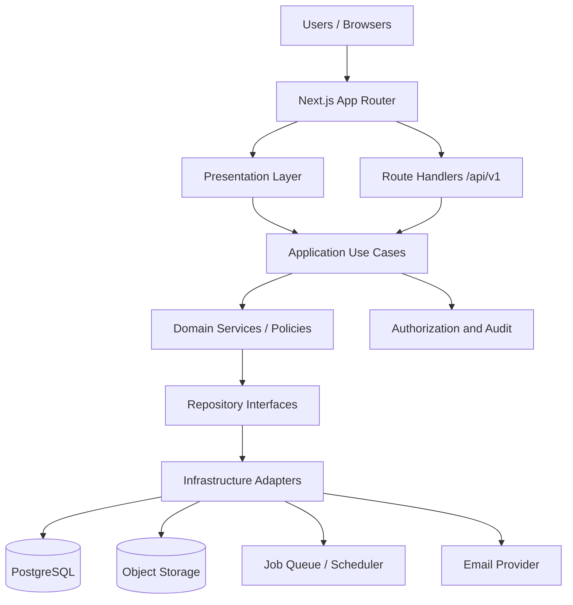

# Phase 3 - Application Architecture and Project Structure

## Objective
Define the Next.js application architecture, module boundaries, cross-cutting patterns, and deployment approach before implementation.

## Architectural Summary
- Single Next.js App Router codebase for UI and API.
- Modular-monolith structure aligned to business domains.
- Server Components for server-rendered pages and initial data loading.
- Client Components only for interactivity, forms, calendars, and rich tables.
- Route Handlers for versioned external APIs under `/api/v1`.
- Server Actions only for tightly scoped internal form mutations.
- Business logic isolated in domain services and application use cases.
- Prisma as the ORM with repository-style data access helpers where useful.
- PostgreSQL as the single source of truth.

## Architecture Diagram


## Proposed Folder Structure
```text
src/
  app/
    (auth)/
    (protected)/
    api/
      v1/
    layout.tsx
    page.tsx
  components/
    ui/
    layout/
    data-display/
    forms/
  features/
    auth/
    dashboard/
    master-data/
    properties/
    bookings/
    allocations/
    shop/
    flats/
    notices/
    reports/
    notifications/
    audit/
    settings/
    search/
  server/
    actions/
    api/
    use-cases/
    services/
    repositories/
    auth/
    authorization/
    validation/
    logging/
    storage/
    notifications/
    reports/
    jobs/
    audit/
    db/
  lib/
    env/
    constants/
    utils/
    date/
    money/
    cnic/
    phone/
  styles/
  types/
prisma/
  schema.prisma
  migrations/
docs/
  adr/
tests/
  unit/
  integration/
  e2e/
```

## Module Boundaries
### Presentation Layer
- Renders screens, forms, tables, dialogs, calendars, and dashboards.
- Does not contain business rules.
- Can coordinate client-side state, queries, and optimistic UI when safe.

### Application Layer
- Orchestrates use cases such as creating bookings, approving allocations, generating bills, and issuing notices.
- Owns transaction boundaries and workflow orchestration.
- Calls authorization, validation, audit, and repository abstractions.

### Domain Layer
- Contains business rules, invariants, status transitions, conflict rules, money calculations, and policy logic.
- No framework dependencies.

### Infrastructure Layer
- Prisma adapters, storage providers, queue adapters, email providers, logging, and external integrations.
- Implements repository interfaces and system services.

## Dependency Rules
- Presentation may depend on shared UI and typed DTOs only.
- Presentation must not depend on Prisma or raw database access.
- Application may depend on domain and abstract repository interfaces.
- Domain must not depend on Next.js, Prisma, or infrastructure details.
- Infrastructure may depend on domain contracts but not vice versa.
- Route Handlers and Server Actions must call application use cases, not inline business logic.

## Data-Access Pattern
- Use Prisma through repository implementations or query modules.
- Keep query code in infrastructure modules, not in React components.
- Use explicit DTOs and mapping functions to avoid exposing Prisma models directly.
- Use transactions for multi-step workflows such as booking approval, bill generation, payment allocation, and allocation transfer.
- Use read models or tailored queries for lists, dashboards, and search.

## Service Pattern
- Use small, cohesive use-case services for each workflow.
- Prefer one service per transactionally meaningful operation.
- Keep pure policy functions separate from orchestration services.
- Use domain errors to distinguish validation, conflict, authorization, and state errors.

## Route Handler Pattern
- `/api/v1` remains the public integration surface.
- Handlers parse request metadata, authenticate, authorize, validate, and delegate to use cases.
- Handlers return a consistent response envelope.
- Handlers never contain domain logic or direct Prisma access.

## Server Action Policy
- Server Actions are allowed only for tightly scoped, internal, authenticated mutations.
- Use them for simple form submissions where a Route Handler is unnecessary.
- Do not embed complex business logic inside Server Actions.
- Server Actions must still call the same application use cases as Route Handlers.

## API Response Pattern
- Success: `{ success: true, data, meta? }`
- Error: `{ success: false, error: { code, message, details?, correlationId } }`
- Lists: include pagination metadata, applied filters, and total count where appropriate.
- Validation errors must be structured and field-specific.

## Error Architecture
- Use domain-specific errors for known rule violations.
- Map errors centrally to HTTP status codes and user-safe messages.
- Hide internal stack traces and database details from clients.
- Record correlation IDs for operational tracing.

## Authentication Flow
- Use secure HttpOnly cookies.
- Access tokens remain short-lived.
- Refresh tokens rotate and are stored hashed in the database.
- Session records track device, IP, user agent, revocation, expiry, and token family.
- Logout revokes the current session; logout-all revokes all active sessions.
- Password reset uses a separate secure recovery flow.

## Authorization Flow
- Authentication establishes identity.
- Authorization checks permissions on every protected action.
- Use permission checks plus optional scope checks for department, building, property, or module scope.
- Default deny for sensitive actions.
- Admin roles do not bypass explicit permission checks unless the permission model allows it.

## Storage Abstraction
- Define a storage-provider interface for uploads, signed downloads, deletions, and metadata handling.
- Local adapter is for development only.
- Production adapters should support Vercel Blob or S3-compatible storage.
- File metadata lives in PostgreSQL.

## Background-Job Architecture
- Use idempotent jobs for notifications, report generation, reminders, and scheduled audits.
- Jobs record correlation IDs and execution status.
- Large exports are generated asynchronously and published for download when complete.
- Job retries must be safe to repeat.

## Reporting Architecture
- Small reports may be generated synchronously.
- Large or filtered exports should run as background jobs.
- Reports should use dedicated query paths or read models optimized for reporting.
- Exported files inherit permission checks and data redaction rules.

## Caching Approach
- Use caching only where data consistency allows it.
- Prefer request-level memoization and controlled client-side caching for interactive screens.
- Use TanStack Query only for client-side caching, mutations, and polling.
- Avoid caching sensitive or rapidly changing financial records without explicit invalidation.

## Testing Architecture
- Unit tests for domain rules and utility logic.
- Service-layer tests for orchestration and transactions.
- Validation tests for Zod schemas.
- Authorization tests for permissions and scopes.
- API integration tests for Route Handlers.
- Database integration tests for booking conflicts and allocation constraints.
- Component tests for important UI behaviors.
- E2E tests for critical workflows.
- Accessibility checks for key screens.

## Vercel Deployment Architecture
- Deploy the Next.js app to Vercel.
- Use a managed PostgreSQL provider with pooled connections for runtime traffic.
- Use a direct database connection for migrations and admin tasks.
- Use object storage suitable for Vercel.
- Use environment variables for all secrets and environment-specific settings.
- Provide health-check and readiness endpoints.

## Docker Strategy
- Docker is optional for local development and self-hosting.
- Do not require Docker for the Vercel deployment path.
- If provided, include a development-focused Docker Compose setup and a production-safe Dockerfile.

## ADR Strategy
- Record major decisions in architecture decision records.
- Preserve approved decisions unless a later stakeholder change explicitly revises them.
- Use ADRs for boundary decisions, security choices, storage decisions, and deployment assumptions.

## Acceptance Criteria
- Module boundaries and dependency rules are explicit.
- The app structure is ready for implementation without further architecture debates.
- API, auth, storage, background jobs, and testing patterns are defined.
- Vercel deployment is compatible with the proposed design.
- No implementation code is introduced in this phase.

## Risks And Open Questions
- Exact folder names may need adjustment after the first scaffold to match framework conventions.
- Job infrastructure may evolve depending on the selected deployment and queue provider.
- Reporting read models may need refinement after query profiling.
- The exact scope of Server Actions versus Route Handlers may be adjusted after initial implementation.
